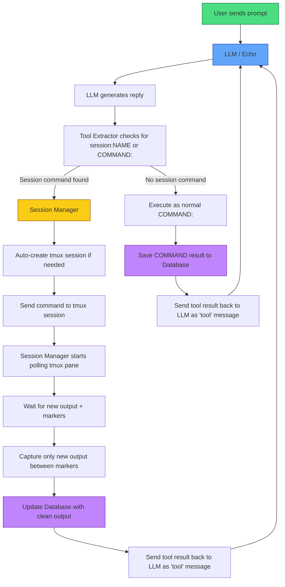

# Echo_rust_agent_proxy
Continuation of [Echo tmux agentv3](https://github.com/charlesericwilson-portfolio/Echo_tmux_agentv3) and adds proxy tool calls, output summarization, and database support.

## Echo Rust Wrapper v5 (In Testing)

**Current Version:** Rust v5 (Python proxy was v4)

This is the active development version of **Echo** — a lightweight, local red-team LLM agent wrapper written in Rust.

### What it does
- Supports **hybrid raw-text tool calling**:
  - `COMMAND: <command>` for simple one-shot shell commands
  - `SESSION:NAME <command>` for persistent tmux sessions (ideal for msfconsole, long-running shells, etc.)
- Automatic tmux session creation/reuse
- Marker-based clean output capture (only returns new command output, not full session history)
- Safety deny list (blocks dangerous commands before execution)
- JSONL logging in ShareGPT format (already capturing training examples of when/why to use SESSION vs COMMAND)
- Fast blocking HTTP client talking to your local llama.cpp servers
- Sqlite database support for tool logging.
- Auto summarization of context at 50K tokens.
- Interrupt generation using ctl+\ end session using ctl+c.

### Current Status – In Active Testing
- COMMAND method is stable and reliable
- SESSION method works well for everything except nmap
- Output capture + summarizer flow is functional
- Deny list is active
- Logging is working and generating clean training data
- Fixed stoping after every tool call model now can chain tools across turns when permitted.
- For build details and screenshots go to [Doc/progress_log.md](https://github.com/charlesericwilson-portfolio/Echo_rust_agent_proxyv5/blob/main/echo_rust_agent_proxy/Doc/progress_log.md)

Persistent sessions with complex tools (full msfconsole workflows) are still being tuned. Context management and summarizer behavior continue to be refined. Database integration for all tool calls for auditing complete.

### Quick Start

 1. Make sure your [llama.cpp](https://github.com/ggml-org/llama.cpp) servers are running
```bash
    - git clone https://github.com/ggml-org/llama.cpp
    - cd llama.cpp
    - cmake -B build
    - cmake --build build --config Release -j$(nproc)
```
    - Main model: port 8080
    - Summarizer (small model): port 8082
 2. Install dependencies
```bash
    - sudo apt install tmux
    - sudo apt install cargo
    - sudo apt install rustup
```
 3. **Build and run the Rust version**
```bash
  cd [build directory]
  cargo build --release
  ./target/release/echo_rust_wrapper
  ```
Next steps: Building datasets and adding database support. Finetuning the base model check it out [Echo_training_project](https://github.com/charlesericwilson-portfolio/Echo_training_project)
